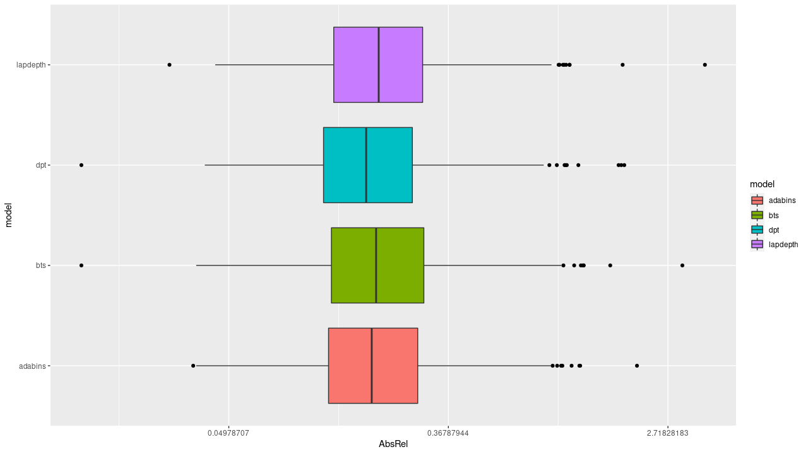
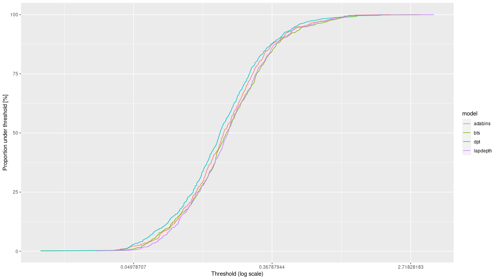

## Depth Prediction

Overview and benchmarks for a selection of methods. 

The task of depth prediction has been vastly studied and early
solutions have been using methods without machine learning. For this
project, we focused however on newer methods using supervised learning
and maximizing the performance of the estimation.

## Datasets 
The models are oriented to work with outside road video. We
focussed on using a dataset with this type of pictures. There are two
academic available dataset, Kitti and Cityscape.  The kitti dataset is
good and is the base dataset we used. It contains rgb images with
their corresponding depth maps. The images are from US cities so it
can best match the data from the sponsor. The Cityscape is also a
dataset for urban street scenes. It is composed of pictures from
Germany but I can be used to create diversity

## Loss

The metric used to compare the performance of the estimations is
AbsRel : 

## Models 

We selected four models for comparaison.
- BTS (2019) a model based on deep convolutional neural network
- Adabins (2020) a model using adaptive segmentation of the depth.
- DPT (2021) a model based on vision transformers
- LapDepth (2021) a model using a Laplacian pyramid

## Evaluation
The evaluation is made on the kitti dataset. The Eigen split is a
selection of 697 images from 61 scenes across the different categories
(city, campus, road and residential).  Here are the results after
running the models on a gpu (Nvidia GTX 1660). Some values differ from
the values given in the respective papers.

|          | Eigen (RTX 1660)                        | Paper Values                  |
|----------|-----------------------------------------|-------------------------------|
| Adabins  | abs rel : 0.060                         | abs rel : 0.058, rmse : 2.360 |
| LapDepth | abs rel : 0.063, rmse 2.738 (GPU 3m57s) | abs rel : 0.059               |
| DPT      | abs rel : 0.062, rmse 2.572 (GPU 13min) | abs rel : 0.062, rmse : 2.573 |
| BTS      | abs rel : 0.060, rmse 2.798 (GPU 2m05s) | abs rel : 0.064               |

The models have a similar behaviour. The values announced in the
respective papers were not found on Adabins and LapDept

The DPT model has a better overall accuracy than the other
models. However it is the model with the biggest execution time. The
resource criterion might have a bigger influence in the commercial
usage of the solutio

